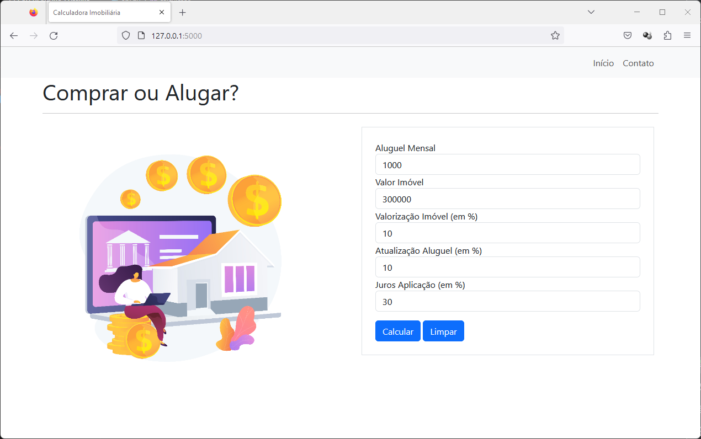

# CalcFin-BuyOrRent
Este projeto faz parte do processo avaliativo do módulo de "Lógica de programação II" do programa "SantanderCoders2023" e tem como finalidade a criação de uma Calculadora Financeira que indicará ao usuário se é mais vantajoso alugar ou comprar um imóvel.

Entradas do programa:
Valor do aluguel por mês.
Montante disponivel pra comprar imovel.
Valoziração em porcentagem por ano.
Taxa de juros do aluguel por ano.
Taxa de juros em uma aplicação determinada.

Saídas do programa:
Valor do Aluguel em 20 anos.
Valorização do Imóvel após 20 anos.
Rendimento do Investimento em 20 anos.
Qual é a melhor opção: comprar ou alugar.

Dependências:
Flask==2.3.2
Flask-WTF==1.1.1

Execute: `python3 main.py`

  

  

  

  

Componentes:
    
 Joelson Ferreira - https://www.linkedin.com/in/joelsons/ 

    
 Liliane de Aquino - https://www.linkedin.com/in/liliane-l-de-aquino-a2999898/ 

Professor:
    
 Igor Garcia - https://www.linkedin.com/in/igorgbs/ 

    
Informações adicionais:
    Entrega será até a segunda-feira (31/07), antes da aula.
    Utilizar apenas as estruturas vistas em aula (Não usar Dataframe).
    Aprensentação em 10 min.
